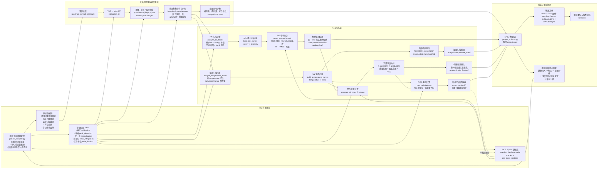
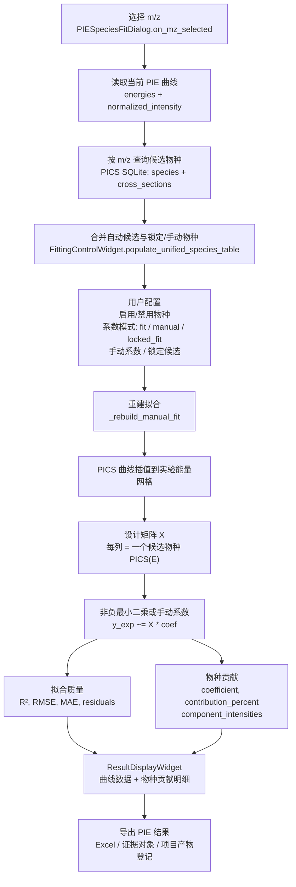

# BL03U 质谱分析工作流 / 数据流优化示意图

## 参数持久化与项目自动加载

### 项目配置文件结构

每个项目在初始化时自动创建 `config/` 目录，其中包含 `project.yaml` 配置文件。

**文件位置**: `project_root/config/project.yaml`

**内容**:
- 项目身份: 名称、系统、描述、输出目录
- 数据源路径: 原始谱图、和谱、温度扫描、PIE扫描位置
- 标定参数: Kr膨胀系数标定文件夹
- 归一化参数: 光源、光强归一化、质量歧视、膨胀系数
- 寻峰参数: 算法选择与17个算法特定参数
- 函数参数: 摩尔分数预设、光电离模式、PIE选项

### 参数持久化流程

```
保存项目 → config/project.yaml 创建/更新
    ↓
关闭项目
    ↓
重新打开项目 → load_project_settings()
    ├─ 自动检测 config/project.yaml
    ├─ 告诉 ProjectSettingsManager 使用项目路径
    ├─ 加载所有参数到 ProjectSettings
    └─ 立即同步到 UI 和参数 widgets
    ↓
所有参数自动恢复，无需手动重新设置 ✓
```

### 用户体验改进

✅ **新建项目按钮**: 绿色突出显示的 "➕ 新建项目" 按钮，一键清空表单
✅ **自动参数加载**: 打开项目时自动恢复所有参数
✅ **自动路径保存**: 数据源路径编辑完成后自动保存（无需手动点保存）
✅ **参数独立页面**: 通用参数和寻峰参数各占一个顶级标签页
✅ **项目隔离**: 每个项目有独立的配置文件，不会相互干扰

## 项目级总览



## PIE 拟合内部数据流



## 相比原图的优化点

- 将“项目管理”拆成项目生命周期、原始数据源、参数配置和 PICS 数据库，避免把控制层与数据源混在同一个框里。
- 增加公共预处理层：谱图读取、TOF 到 m/z 标定、寻峰/卡峰/高斯拟合、峰面积积分和归一化，这是 PIE 与温度扫描共同依赖的数据基础。
- 明确 PIE 拟合不是单纯“物种鉴别”，而是 `m/z 曲线 -> PICS 数据库候选 -> 插值设计矩阵 -> NNLS/手动系数 -> 贡献与拟合质量`。
- 明确温度扫描输出不仅是“m/z 随温度变化”，还包含 IO/Kr 校正、膨胀系数归一化和生成/消耗/中间体分类。
- 将摩尔分数计算放在 PIE 鉴别结果、温度曲线、PICS 数据库和配置参数的交汇处，突出它是定量机理分析的下游模块。
- 增加产物登记闭环：各分析模块导出后写回 `project.yaml`，项目页刷新阶段状态，并可创建项目备份。
